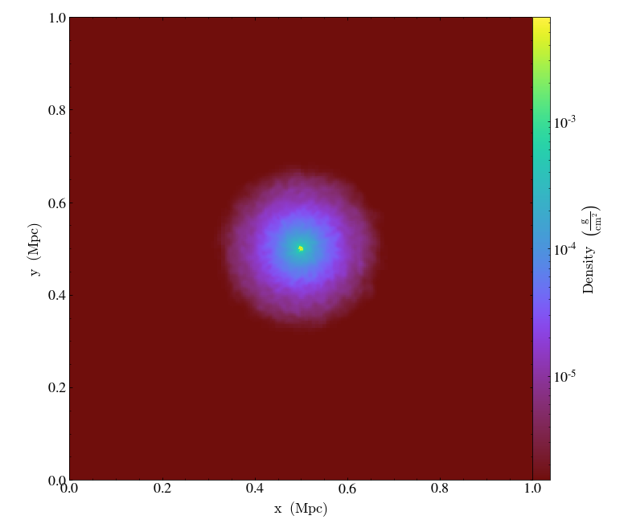
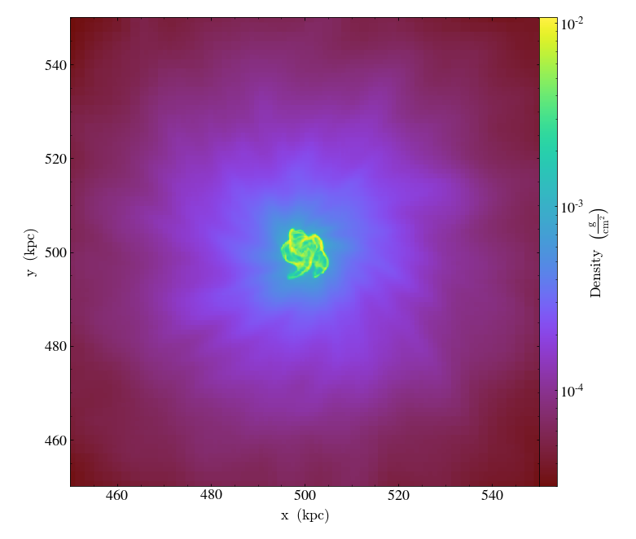
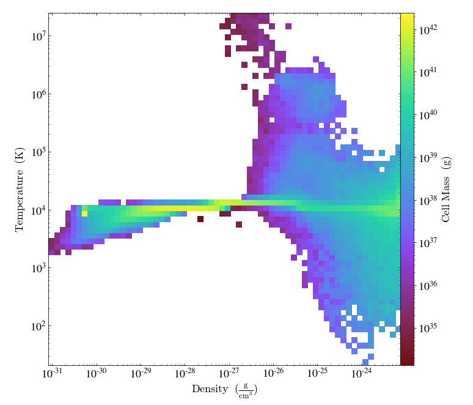
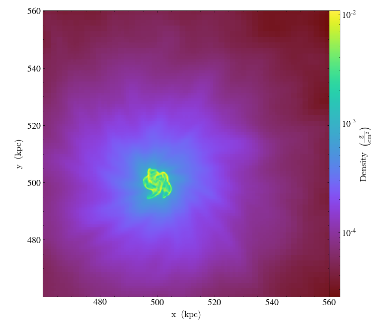

<!-- .slide: class="titleslide" -->

# state of viz in yt

## Matthew Turk

<p data-markdown=true><tt>matthewturk@gmail.com</tt></p>

---

# Hi.

<p class="fragment">I'd like to just take a minute to say how grateful I am to
have this opportunity to share this talk with you, to see the other talks and
research folks will be sharing, and that we all have the ability to be here and
to be "present" for this experience.</p>

---

yt is less a visualization engine than a set of components for constructing the **inputs** to visualization engines.

Let's think about three potential categories of visualization: <!-- .element: class="fragment" data-fragment-index="1" -->

<div class="multiCol">
    <div class="col">
        <ul>
            <li class="fragment" data-fragment-index="2">Visualizations we make for ourselves</li>
            <li class="fragment" data-fragment-index="3">Visualizations we make for our peers</li>
            <li class="fragment" data-fragment-index="4">Visualizations we make for everyone else</li>
        </ul>
    </div>
    <div class="col">
        <ul>
            <li class="fragment" data-fragment-index="2" style="list-style-type:none;">(Our excellent adventure)</li>
            <li class="fragment" data-fragment-index="3" style="list-style-type:none;">(A bogus journey)</li>
            <li class="fragment" data-fragment-index="4" style="list-style-type:none;">(Time to face the music)</li>
        </ul>
    </div>
</div>

<div class="fragment" data-fragment-index="5">

Each of these brings with it different needs for **narrative**, for
**interactivity**, for **control** and for the **visual language** we use to convey
information.

</div>

<div class="fragment" data-fragment-index="5">

So let's take a look at some of the most common things we do in yt.

</div>


---

## "Seeing" the data

<div class="multiCol">
<div class="col">

```python
ds = yt.load_sample("IsolatedGalaxy")
p = ds.r[:].integrate("density", axis="z").plot()
```

<p class="fragment" data-fragment-index="2">
But, what is happening?
</p>

<ol>
<li class="fragment">Data is selected</li>
<li class="fragment">Index is collapsed into a quadtree</li>
<li class="fragment">Data is chunk-by-chunk loaded and applied to quadtree</li>
<li class="fragment">Quadtree is used to create 2D data value buffer</li>
<li class="fragment">Data values passed to matplotlib</li>

</div>
<div class="col">

<!-- .element: class="fragment" data-fragment-index="1" -->

</div>
</div>

---

## "Seeing" the data

<div class="multiCol">
<div class="col">

```python
p.zoom(10)
```

<p class="fragment" data-fragment-index="2">
What has to happen this time?
</p>

<ol class="fragment">
<li><del>Data is selected</del></li>
<li><del>Index is collapsed into a quadtree</del></li>
<li><del>Data is chunk-by-chunk loaded and applied to quadtree</del></li>
<li>Quadtree is used to create 2D data value buffer</li>
<li>Data values passed to matplotlib</li>

</div>
<div class="col">

<!-- .element: class="fragment" data-fragment-index="1" -->

</div>
</div>

---

## "Exploring" the data

<div class="multiCol">
    <div class="col">

```python
ds = yt.load_sample("IsolatedGalaxy")
ds.r[(0.4,'Mpc'):0.6,:,:].profile(
    ["density", "temperature"],
    "cell_mass",
    weight_field=None).plot()
```

<p class="fragment" data-fragment-index="2">

But, again, what is <i>actually</i> happening?

</p>

<ol>
    <li class="fragment">Data is selected</li>
    <li class="fragment">Bounds are computed (optional)</li>
    <li class="fragment">Data is loaded and placed into bins</li>
    <li class="fragment">Bins and bounds are passed to matplotlib as 2D data value buffer</li>
</ol>


</div>
<div class="col">

<!-- .element: class="fragment" data-fragment-index="1" -->

</div>
</div>

---

# Let's take a step back

This is what yt does from a **pragmatic** perspective, but can we apply a set of categories of operations to this?

(Be sure to come to Sam Walkow's talk tomorrow!) <!-- .element: class="fragment" -->

---

# Vocabulary of Data Analysis

<div class="appearing_row" style="margin-top: 1em;">
  <div class="fragment" data-fragment-index=1>
  <div class="right_align">
    <span><i class="fas fa-align-right fa-5x"></i></span>
  </div>
  </div>
  <div class="fragment" data-fragment-index=1>
  <div class="left_align" style="font-size: 200%;">
    Registration
  </div>
  </div>
</div>

<br clear="all"/>

<div class="appearing_row" style="margin-top: 1em;">
  <div class="fragment" data-fragment-index=2>
  <div class="right_align">
    <span><i class="fas fa-calculator fa-5x"></i></span>
  </div>
  </div>
  <div class="fragment" data-fragment-index=2>
  <div class="left_align" style="font-size: 200%;">
    Transformation
  </div>
  </div>
</div>

<br clear="all"/>

<div class="appearing_row" style="margin-top: 1em;">
  <div class="fragment" data-fragment-index=3>
  <div class="right_align">
    <span><i class="fas fa-object-group fa-5x"></i></span>
  </div>
  </div>
  <div class="fragment" data-fragment-index=3>
  <div class="left_align" style="font-size: 200%;">
    Selection
  </div>
  </div>
</div>

<br clear="all"/>

<div class="appearing_row" style="margin-top: 1em;">
  <div class="fragment" data-fragment-index=4>
  <div class="right_align">
    <span><i class="fas fa-mortar-pestle fa-5x"></i></span>
  </div>
  <div class="fragment" data-fragment-index=4>
  <div class="left_align" style="font-size: 200%;">
    Reduction
  </div>
  </div>
</div>

<br clear="all"/>

---

<div class="multiCol">
<div class="col">

# Registration

<p class="fragment">Data is laid out on <b>disk</b> in some manner that may or may not correspond to the spatial organization or physical meaning of what it represents.</p>

<p class="fragment">This data can be laid out in a data structure in <b>memory</b> that represents its logical ordering, with axes and dimensions.</p>

<p class="fragment">Finally, we can register one or multiple datasets in a consistent <b>spatial</b> representation so that we can query fields at specific locations and define $f(\mathbf{x})$.</p>

</div>

<div class="col">
<div class="fig-container" data-file="/2020-10-26-visastro-grammar-of-analysis/figures/volume_layout.html" data-preload data-style="height: 600px;">
</div>
</div>
</div>

---

<div class="multiCol">
<div class="col">

# Registration

<p class="fragment">Given a functional form, discretely sampled data can also be registered for analysis, regardless of its layout on disk.</p>

<div class="fragment" data-markdown=true>
<p>This data may carry with it attributes regarding the density of samples, its neighbors, and fundamental quantities, which can be input into a sampling function over a location.</p>

`$$ A(\mathbf{r}) = \int A(\mathbf{r}')W(|\mathbf{r} - \mathbf{r}'|, h)\mathrm{d} V(\mathbf{r}') $$`
</div>

</div>

<div class="col">
<div class="fig-container" data-file="/2020-10-26-visastro-grammar-of-analysis/figures/particle_layout.html" data-preload data-style="height: 600px;">
</div>
</div>
</div>


---

<div class="multiCol">
<div class="col">
<div class="fig-container" data-file="/2020-10-26-visastro-grammar-of-analysis/figures/galaxy_transformations.html" data-preload data-style="height: 768px;">
</div>
</div>
<div class="col" data-markdown=true>

# Transformations

<p class="fragment">"Primitive" variables: $\rho, \mathbf{v}, e, ...$ can be combined in many different ways to produce fields that exist <i>in potentia</i>.</p>
<p class="fragment">Registration enables combinations at fixed spatial locations.</p>
<p class="fragment">For example, we can apply the arithmetic manipulation:
$$|v| = \sqrt{v_x^2 + v_y^2}$$
</p>
</div>
</div>

---

<div class="multiCol">
<div class="col" data-markdown=true>

# Selection

<p>Points can be filtered based on their connectivity, spatial organization, or criteria from one or more field values.</p>
</div>
<div class="col">
<div class="fig-container" data-file="/2020-10-26-visastro-grammar-of-analysis/figures/kh_operations.html" data-preload data-style="height: 768px;">
</div>
</div>
</div>

---

# Reductions

We can apply reductions along axes, paths and non-trivial manifolds.

<div class="fig-container" data-file="/2020-10-26-visastro-grammar-of-analysis/figures/kh_path.html" data-preload data-style="height: 600px;">
</div>

---

# Composability

<div class="fig-container" data-file="/2020-10-26-visastro-grammar-of-analysis/figures/cosmology.html" data-preload data-style="width: 900px;">

---

# OK, whatever, Matt

You're probably thinking, this looks a lot different than what I usually do with yt. <!-- .element: class="fragment" -->

And OK, you're right. <!-- .element: class="fragment" -->

But let's think again about who we aim our three types of visualization at:<!-- .element: class="fragment" -->

<span class="fragment"><b>ourselves</b>,</span> 
<span class="fragment"><b>our peers</b>,</span>
<span class="fragment">and <b>everyone else</b>.</span>

<p class="fragment">I would argue that at present, yt naturally encourages us to think far too
often about visualizations for <b>our peers</b> at the expense of
visualizations for <b>ourselves</b>.</p>

---

## The "Plot Window"

The `PlotWindow` object does so much!  And it does it all really well, and thoughtfully!

<div class="fragment">

It manages a fairly large amount of state:

 * What to do when you move the viewport
 * Labels on axes and units
 * Data-centric annotations on the plot
 * Log, unlog, buffer size

Nearly all of this interfaces directly with matplotlib.

</div>

<div class="fragment">

Importantly, though, while it utilizes matplotlib, that does not make it
*redundant* with matplotlib.  This is an important distinction!

</div>

---

## Overlapping without Redundancy

Matplotlib is a visualization engine that provides *many* things that yt
utilizes under the hood, and some things yt does not.  yt presents a largely
"stateful" approach to plots, with our state divided into roughly two different categories:

 * State that is guided by data or metadata of the field, dataset or collection
   being visualization
 * State that is guided by explicit wrappers around matplotlib functionality

<p class="fragment">
(As a sidenote, it's awfully trendy in some circles to take cheap shots at
matplotlib, and I really think that's unfair and bad form.  How's <i>that</i>
for a strawperson argument?)
</p>

---

## Overlapping ... redundantly

On the other hand, the argument could be made that perhaps `PlotWindow` does too much.  Maybe it's too tricky to get at the raw buffers?

For slices, we can get around this nicely:

```python
buf = ds.r[::1024j,::1024j,0.5]["density"]
```

but for projections it's a bit trickier:

```python
buf = ds.r[:].integrate("density", axis="z").to_frb()["density"]
```

---

## The Other types of Viz

<div class="multiCol">
<div class="col">

I still haven't talked about the other types of visualization, though!  So let's fix that.

If you wanted to interactively explore a projection plot, you can *of course* use the API:

```python
p.pan_rel((0.1, 0.1))
```

<div class="fragment" data-fragment-index="2">And the best thing is, this is definitely not cumbersome in any way!</div>

<div class="fragment" data-fragment-index="2">Plus, matplotlib is definitely the only visualization engine out there and suitable for all possible circumstances!</div>

</div>
<div class="col">

<!-- .element: class="fragment" data-fragment-index="1" -->

</div>

---

## Always naysaying!

OK, OK, let's tone it down a little bit and just be excellent to each other.

Time to focus on ideas for how we can make this better.  So here are a few:

<ul>
<li class="fragment">Make it easier to get yt out of your way.</li>
<li class="fragment">Make exploratory methods and widgets</li>
<li class="fragment">Supply data to exploratory tools</li>
</ul>

---

## Widgyts

Madicken Munk and I started working on this a few years ago, with the thought, "What if we invested some time in pushing data to the client to improve interactivity?" and it kind of spiraled from there!

[data-exp-lab/widgyts](https://github.com/data-exp-lab/widgyts)

(Time for the demo)<!-- .element: class="fragment" -->

---

## `yt_idv` (or, `kyvol_ren`)

This one was started by Chuck Rozhon many years ago, and kind of stopped for a while after he graduated.  But then a few years ago I started fiddling with it, and then Chris Havlin and I started digging lots deeper this summer, and now it's kind of working?

[data-exp-lab/yt_idv](https://github.com/data-exp-lab/yt_idv)

(Time for the demo)<!-- .element: class="fragment" -->

---

## Some Last Minute Thoughts on State Management

A lot of code in yt would be simplified if we started thinking about our
objects as explicitly stateful, with well-defined transitions between states.

(Come to my lightning talk about declarative analysis!) <!-- .element: class="fragment" -->

---

<!-- .slide: class="titleslide" -->

# Thank you!
